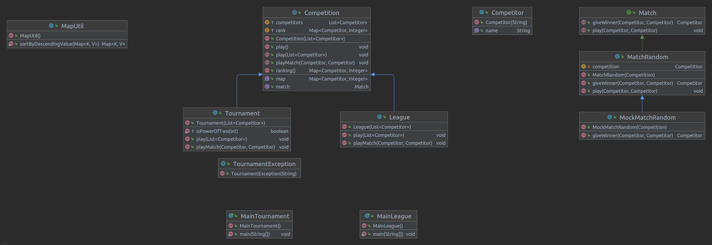
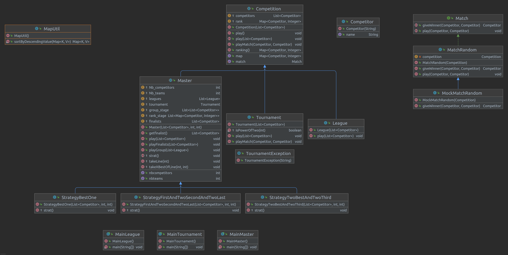
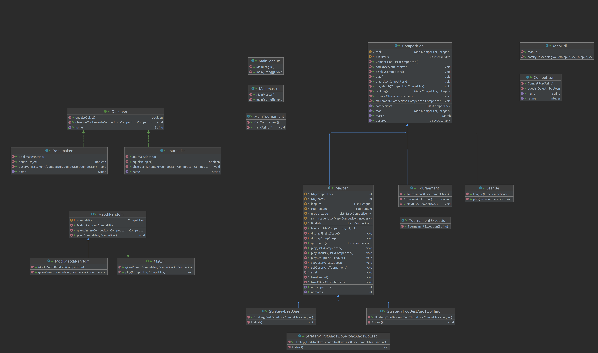

# Projet-COO

* Dewame Remi
* Axel Roelants


# I Introduction 
## Projet: Compétitions Sportives
Le but de ce projet est la création de compétitions sportives avec possibilité d'évolution (nouveau type de match, nouvelle compétition...).


Pour le premier livrable ils nous aient demandé de réaliser deux types de compétition et un type de match tout en laissant la possibilité de rajouter par la suite d'autres types sans devoir toucher au code initial.

Cahiers des charges :
* Polymorphisme 
* Match 
    * Il y a forcément un gagnant pour chaque match.
    * Chaques compétiteurs à la même chance de remporter un match.
    * Le gagnant est obtenu de maniére aléatoire et il remporte 1 point.
* Compétition 
    * La compétion termine lorsque l'ensemble des matchs ont été joués.
    * League :
        * Les match se déroule en aller-retour.
        * Les competiteurs se rencontre 2 fois.
        * Le vainqueur est celui ayant remporter le plus de match.
    
    * Tournament :
        * Chaque compétiteur rencontre un adversaire, le vainqueur rencrontreras les autre vainqueur des autres matchs.
        * Il y a plusieurs tours de jeu.
        * Durant chaque match jouer il y'auras un vainqueur et un perdant (eliminé).
        * La taille de la liste des compétiteurs est obligatoirement une puissance de 2.
        * Le dernier compétiteur est le vainqueur du tournois.

    * Master (Livrable 2) :
        * Les compétiteurs s'affronte en deux phase.
        * Poule organisé sous forme de championnat.
        * Phase finale se déroule sous la forme d'un tournois à élimination directe.
        * Le competiteur remportant la phase finale est le vainqueur.

    * Observer (Livrable 3) :
        * Les observateurs peuvent assister aux compétitions .
        * Ils diffusent les résultats des matchs de la compétition.
        * Il y a les journalitstes qui diffusent le résultat de chaque match.
        * Et les bookmakers qui diffusent le résultat ainsi que la cote de chaque match.

Pour le développement nous allons utiliser la programmation orientée objet afin de répondre à l'ensemble des critères du cahier des charges (Java).


Liens :  
* Livrable 1 :
    * <a href="https://www.fil.univ-lille1.fr/~quinton/coo/projet/competitions.pdf"> Sujet</a>
* Livrable 2 :
    * <a href="https://www.fil.univ-lille1.fr/~quinton/coo/projet/competitionsV2.pdf"> Sujet</a>
* Livrable 3 :
    * <a href="https://www.fil.univ-lille1.fr/~quinton/coo/projet/competitionsV3.pdf"> Sujet</a>
* <a href="https://www.fil.univ-lille1.fr/~quinton/coo/projet/consignesRenduProjet.pdf"> Consigne</a>

# II HowTo
## Récupération du dépot :
* Exécuter la commande suivante pour récupérer le dépot :
    ```
    Git clone https://gitlab-etu.fil.univ-lille1.fr/roelants/coo_roelants_dewame.git
    ```
## Commande de la génération de la documentation :
* Ce placer à la racine du dépot est exécuter la commande suivante : 
    ```
    make doc
    ```
* Une fois la documentation créer accéder au dossier "doc" puis ouvrer "index.html".
## Commandes de la génération de l'archive du projet
* Génération archive du projet (League) : Ce placer à la racine du dépot est exécuter la commande suivante :
    ```
    make league.jar
    ```
* Génération archive du projet (Tournament) : Ce placer à la racine du dépot est exécuter la commande suivante :
    ```
    make tournament.jar
    ```
* Génération archive du projet (Master) : Ce placer à la racine du dépot est exécuter la commande suivante :
    ```
    make master.jar
    ```
## Commandes d'exécution de l'archive générer
* Exécution archive du projet (League) : Ce placer à la racine du dépot est exécuter la commande suivante :
    ```
    make league
    ```
* Exécution archive du projet (Tournament) : Ce placer à la racine du dépot est exécuter la commande suivante :
    ```
    make tournament
    ```
* Exécution archive du projet (Master) : Ce placer à la racine du dépot est exécuter la commande suivante :
    ```
    make master
    ```
## Commande de la génération des tests du projet
Génération des tests : Ce placer à la racine du dépot est exécuter la commande suivante :
```
make cls_test
```

## Commandes d'exécution des tests
Exécution des tests : Ce placer à la racine du dépot est exécuter les commandes suivante (Il faudras compiler les tests avant d'exécuter ces commandes) :
* Test de MatchRandom :
```
make testmatchrandom
```

* Test de League :
```
make testleague
```

* Test de Tournament :
```
make testtournament
```

* Test de MasterStrategy1Test :
```
make teststrategy1
```
* Test de MasterStrategy2Test :
```
make teststrategy2
```

* Test de MasterStrategy3Test :
```
make teststrategy3
```


# III Présentation d'elements du code
## Elements de conception que vous jugez interessants/importants :
* ### UML livrable 1 :

* Mock à été un elément de conception intéressants et important cela nous a permis de surcharger la méthode givewinner afin de réaliser des tests.

* ### UML livrable 2 :

* Méthode abstraite "strat()" dans master qui nous permet de creer plusieurs strategy.
* Méthode abstraite "create competition()" dans CompetitionTest qui permet de faire les tests de chaques compétitions.
* Méthode "takeLine(int l)" dans Master qui nous permet de selectioné les joueurs de la ligne l de chaques poules.
* Méthode "takeXBestOfLine(int l,int x)" dans Master qui nous permet de selectioné le/s x meilleur/s a la ligne l de chaques poules.

* ### UML livrable 3 :


## Présentation des principes de conception mis en oeuvre :
* Polymorphisme 
* Principe ouvert-fermé (Un code doit etre ouvert aux extensions et fermé aux modifications).
* Late-binding Lookup.
* Mock (fourni une implémentation d’interface).


## Mise en valeur :
* Vous ếtes un enseignant formidable ! (Livrable 1)
* Vous êtes toujours un enseignant formidable ! (livrable 2)